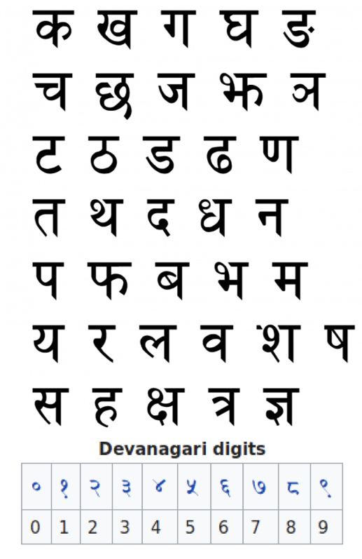

<font size="4">One of the very first projects that one does when learning convolutional neural networks is on the MNIST dataset that contains images for handwritten digits from 0-9. Similar Convolutional neural network analysis can also be used for recognising hand-written alphabets of various scripts. <br><br>
In this blog I will use convolutional neural networks for the identification of hand written consonants (36) and digits (10) of the devanagari script (script used for the Indian languages Hindi and Marathi). <br><br>
The consonants and digits of the devnagari script look like this:</font>

<br>


<br>

## Note about the dataset:
<font size="4">The images for the hand-written 46 devanagari characters are stored in the 'DevanagariHandwrittenCharacterDataset' folder in the same directory as this notebook. The folder contains the train and test folders which have 1701 and 301 images of the 46 alphabets.<br><br></font>

<font size="4"> First let's import the necessary modules</font>


```python
import torch
from torch.nn import Linear, ReLU, CrossEntropyLoss, Sequential, Conv2d, MaxPool2d, Module
from torch.optim import Adam
from torch import nn,optim
from torch.optim import lr_scheduler
from torch.utils.data import DataLoader
from torchvision import transforms
from torchvision.datasets import ImageFolder

from PIL import Image

import numpy as np
import matplotlib.pyplot as plt
import cv2
%matplotlib inline
```

<font size="4">Now let's take a look at some of the images.</font>


```python
# an image of the consonant 'dhaa'

dhaa = cv2.imread('DevanagariHandwrittenCharacterDataset/train/character_14_dhaa/10717.png',0)
plt.imshow(dhaa,cmap='gray_r')
dhaa.shape
```


    (32, 32)


```python
#an image of the consonant 'na'

na = cv2.imread('DevanagariHandwrittenCharacterDataset/train/character_20_na/11052.png',0)
plt.imshow(na,cmap='gray_r')
na.shape
```


    (32, 32)


***
<font size="4">Let's load the images into train and test dataloaders next. The images are in grayscale and since the values range from 0-255, we will normalize them by dividing the images by 255. We will also define our neural network model here that consists of just one convolutional layer followed by a pooling payer.</font>


```python
trans = transforms.Compose([transforms.Grayscale(num_output_channels=1), transforms.ToTensor(), transforms.Normalize((0.1307,), (0.3081,))])
#( note: the ToTensor() transform automatically normalizes the images by dividing by 255)


train = ImageFolder('DevanagariHandwrittenCharacterDataset/train', transform=trans, loader=lambda path: Image.open(path).convert("LA"))
test = ImageFolder('DevanagariHandwrittenCharacterDataset/test', transform=trans,loader=lambda path: Image.open(path).convert("LA"))

# ImageFolder is a generic data loader which needs the images to be arranged inside the root_directory with different folders for each category
# (note: ImageFolder's default loader loads RGB images by default, since we have Grayscale images we are using a custom loader here.)

# Data loaders for test and train sets
train_loader = DataLoader(train, batch_size=100, shuffle=True)
test_loader = DataLoader(test, batch_size=100, shuffle=False)

# checking for GPU
device = torch.device("cuda:0" if torch.cuda.is_available() else "cpu")

# Defining the CNN net
class Net(Module):   
    def __init__(self):
        super(Net, self).__init__()

        self.cnn_layer = Sequential(
            # Defining a 2D convolution layer with 5x5 kernels, 0 padding, 1 stride
            # => output image size = ((32-5+0)/1)+1 = 28x28
            Conv2d(1,32,kernel_size=(5,5)),
            
            # with RELU activation
            ReLU(inplace=True),
            
            # add a Pooling layer with 2x2 kernels
            # => output image size 28/2 = 14x14
            MaxPool2d(2))   
        
        # A fully connected layer with 128 kernels (image size 14x14)
        self.fc1=Linear(32*14*14,128)
        
        # Output layer with 46 outputs for the 46 categories
        self.fc2=Linear(128,46)


    # Defining the forward pass    
    def forward(self, x):
        
        # perform the convolution and pooling
        out = self.cnn_layer(x)
        
        # flatten the output
        out = out.reshape(out.size(0), -1)
        
        # pass through the fully connected layers
        out = self.fc1(out)
        out = self.fc2(out)
        
        return out


model=Net()
model.to(device)

```


    Net(
      (cnn_layer): Sequential(
        (0): Conv2d(1, 32, kernel_size=(5, 5), stride=(1, 1))
        (1): ReLU(inplace=True)
        (2): MaxPool2d(kernel_size=2, stride=2, padding=0, dilation=1, ceil_mode=False)
      )
      (fc1): Linear(in_features=6272, out_features=128, bias=True)
      (fc2): Linear(in_features=128, out_features=46, bias=True)
    )


***
<br>
<font size="4">Here we train the training data for 10 epochs.</font>


```python
# learning rate for weight optimization
learning_rate=0.0001

# using crossentropy loss for categorical inputs
criterion = torch.nn.CrossEntropyLoss()

# using Adam optimizer
optimizer = Adam(model.parameters(), lr=learning_rate)

#Reduce learning rate lr by a factor of 0.1 every 7 epochs
step_lr = lr_scheduler.StepLR(optimizer, step_size=7, gamma=0.1)

#Training
total_step = len(train_loader)
nb_epoch=10

test_loss_epoch = []
test_accuracy = []
train_loss_epoch = []
train_accuracy = []

for epoch in range(nb_epoch):
    
    train_acc = 0
    test_acc = 0
    train_loss = []
    test_loss = []
    
    
    model.train()
    
    with torch.set_grad_enabled(True):
        for i, (images, labels) in enumerate(train_loader):
            inputs = images.to(device)
            targets = labels.to(device)

            # clearing the Gradients of the model parameters
            optimizer.zero_grad()

            # prediction for training and validation set
            output = model(inputs)
            # compute cross entropy loss
            loss = criterion(output, targets)
            # predict the class using the index of the maximum value from the output 
            _, pred = torch.max(output, 1)

            train_acc += torch.sum(targets == pred)

            # Backpropagate and optimize
            loss.backward()
            optimizer.step()

            train_loss.append(loss.detach().cpu().numpy())
            
            # print the loss every 100 training batches
            #if i%100 == 0:
            #    print('Iteration {} in Epoch {} Train Loss: {}'.format(i, epoch, loss))
                
    model.eval()
    
    with torch.set_grad_enabled(False):
        for i, (images, labels) in enumerate(test_loader):
            inputs_test = images.to(device)
            targets_test = labels.to(device)

            output = model(inputs_test)
            # Compute cross entropy loss
            loss_test = criterion(output, targets_test)
            # predict the class using the index of the maximum value from the output 
            _, pred = torch.max(output, 1)
            test_acc += torch.sum(targets_test == pred)
            test_loss.append(loss_test.detach().cpu().numpy())
            
    # append the average values of the training loss, training accuracy, test loss and test accuracy per epoch
    train_loss_epoch.append(sum(train_loss)/len(train_loader))
    test_loss_epoch.append(sum(test_loss)/len(test_loader))
    train_accuracy.append(train_acc.cpu().numpy()/len(train))
    test_accuracy.append(test_acc.cpu().numpy()/len(test))
    
    # print the average values of the training loss, training accuracy, test loss and test accuracy for every epoch
    print('Epoch: {}, Train Loss: {} Train Accuracy: {}// Test Loss: {} Test Accuracy: {}'.format(epoch, sum(train_loss)/len(train_loader), train_acc.cpu().numpy()/len(train), sum(test_loss)/len(test_loader), test_acc.cpu().numpy()/len(test)))
            
    #Change learning rate every seven epochs
    step_lr.step()
    
```

    Epoch: 0, Train Loss: 0.3868787087633482 Train Accuracy: 0.8979411764705882// Test Loss: 0.32355933535196213 Test Accuracy: 0.9116666666666666
    Epoch: 1, Train Loss: 0.2602155260417772 Train Accuracy: 0.9305882352941176// Test Loss: 0.2488288624090669 Test Accuracy: 0.9303623188405797
    Epoch: 2, Train Loss: 0.20256089001817776 Train Accuracy: 0.9447314578005115// Test Loss: 0.20691687623680016 Test Accuracy: 0.9405072463768116
    Epoch: 3, Train Loss: 0.16817442630239002 Train Accuracy: 0.9534910485933504// Test Loss: 0.19727320810847415 Test Accuracy: 0.9440579710144927
    Epoch: 4, Train Loss: 0.1430419230657389 Train Accuracy: 0.9605242966751918// Test Loss: 0.18318232167950846 Test Accuracy: 0.9468115942028985
    Epoch: 5, Train Loss: 0.125040404879681 Train Accuracy: 0.9656265984654732// Test Loss: 0.17676658546585805 Test Accuracy: 0.9478260869565217
    Epoch: 6, Train Loss: 0.10871390549613692 Train Accuracy: 0.9703324808184143// Test Loss: 0.16837371533662351 Test Accuracy: 0.9505797101449275
    Epoch: 7, Train Loss: 0.07718767361510592 Train Accuracy: 0.9822634271099744// Test Loss: 0.14790500730505565 Test Accuracy: 0.957391304347826
    Epoch: 8, Train Loss: 0.07299210469398047 Train Accuracy: 0.9836828644501279// Test Loss: 0.14500730275851337 Test Accuracy: 0.957463768115942
    Epoch: 9, Train Loss: 0.07092668767780294 Train Accuracy: 0.9843478260869565// Test Loss: 0.14453112384290906 Test Accuracy: 0.9588405797101449


***
## Plotting losses for training and test sets


```python
import seaborn as sns

sns.set()
fig, ax = plt.subplots(1, 1, figsize = (12, 9))
ax.plot(train_loss_epoch, label='Training Loss')
ax.plot(test_loss_epoch, label='Test Loss')
ax.set_xlabel('Epoch',fontsize=20)
ax.set_ylabel('Loss',fontsize=20)
plt.xticks(fontsize=20)
plt.yticks(fontsize=20)
ax.legend(loc='best',fontsize=20)
fig.savefig('devnagari_alphabet_recognition_loss_inception_net.png', dpi=300)
```


***
## Plotting accuracies for training and test sets


```python
fig1, ax1 = plt.subplots(1, 1, figsize = (12, 9))
ax1.plot(train_accuracy, label='Training Acc')
ax1.plot(test_accuracy, label='Test Acc')
ax1.set_xlabel('Epoch',fontsize=20)
ax1.set_ylabel('Accuracy',fontsize=20)
plt.xticks(fontsize=20)
plt.yticks(fontsize=20)
ax1.legend(loc='best',fontsize=20)
fig1.savefig('devnagari_alphabet_recognition_accuracy_inception_net.png', dpi=300)
```


***
## Testing for example images


```python
# an image of the Devnagari consonant 'bha'
file = 'DevanagariHandwrittenCharacterDataset/test/character_24_bha/17529.png'
img = Image.open(file).convert("L")
plt.imshow(np.asarray(img),cmap='gray_r')
img = transforms.Normalize((0.1307,), (0.3081,))(transforms.ToTensor()(img))
img = img.unsqueeze(0)
img.size()
_, pred = torch.max(model(img), 1)
print(pred,train.classes[pred])
```

    tensor([15]) character_24_bha


```python
# an image of the Devnagari consonant 'ya' or 'yaw'
file = 'DevanagariHandwrittenCharacterDataset/test/character_26_yaw/10528.png'
img = Image.open(file).convert("L")
plt.imshow(np.asarray(img),cmap='gray_r')
img = transforms.Normalize((0.1307,), (0.3081,))(transforms.ToTensor()(img))
img = img.unsqueeze(0)
img.size()
_, pred = torch.max(model(img), 1)
print(pred,train.classes[pred])
```

    tensor([17]) character_26_yaw


<br>
<font size="4">So we see that the accuracy seems to be quite good (~96% for the test set) and the classification seems to be correct, even with the very simple CNN model and just 10 epochs of training.</font>


```python

```
